# 🚀 StoreFlow Inventory Management System

> **A production-oriented Inventory, Billing, Reporting, and Analytics System built with Python, Flask, SQLite, HTML, and CSS while learning Software Engineering principles.**

---

## 📖 Project Overview

StoreFlow is a full-stack inventory management system developed as the capstone project of my **14-Day Software Engineering Bootcamp**. Instead of focusing only on writing code, this project was built by following professional software engineering practices such as **Layered Architecture, Separation of Concerns, Validation, Authentication, Reporting, Configuration Management, and Refactoring**.

The objective was not simply to create an inventory application, but to understand **how medium-sized software projects are designed, structured, implemented, and maintained** in a professional environment.

Throughout the project, every new feature was designed before implementation, reviewed after completion, and continuously improved to build the mindset of a Software Engineer rather than just a programmer.

---

# ✨ Project Highlights

### 📦 Inventory Management

- Add Products
- Edit Products
- Delete Products
- Product Search
- Inventory Summary
- Low Stock Alerts
- Inventory Valuation Report

---

### 🛒 Billing System

- Shopping Cart
- Quantity Management
- Checkout Workflow
- Automatic Invoice Generation
- Sequential Invoice Numbers
- Printable Invoices
- Historical Invoice Viewer
- Void Sale with Automatic Stock Restoration

---

### 📊 Analytics & Reports

- Dashboard KPIs
- Daily Revenue Summary
- Sales Count
- Units Sold
- Top 5 Best Selling Products
- 7-Day Revenue Analytics
- Sales Reporting
- Inventory Reporting
- CSV Export (Inventory)
- CSV Export (Sales)
- Dynamic CSV File Names

---

### 🔐 Authentication & Security

- Secure Login System
- Password Hashing
- Flask Session Authentication
- Global Route Protection
- Logout Workflow
- Server-side Validation
- Input Sanitization
- Custom Error Pages (404 & 500)
- Flash Messaging System

---

### ⚙️ Configuration Management

- Dynamic Store Name
- Dynamic Address
- Dynamic Phone Number
- Dynamic Email
- Dynamic Currency
- Dynamic Tax Rate
- Configurable Low Stock Threshold
- Database-driven Application Settings
- Global Flask Context Processor

---

# 🎯 Goals of the Project

The purpose of StoreFlow was to learn:

- Software Engineering Thinking
- Project Architecture
- Flask Development
- SQLite Database Design
- Backend Development
- Business Logic Separation
- Authentication
- Sessions
- Reporting Systems
- Error Handling
- Production Readiness
- Code Organization
- Git & GitHub Workflow

instead of only learning syntax.

---

# 🛠 Tech Stack

| Category | Technology |
|----------|------------|
| Language | Python |
| Backend | Flask |
| Database | SQLite |
| Frontend | HTML5 |
| Styling | CSS3 |
| Template Engine | Jinja2 |
| Version Control | Git |
| Repository Hosting | GitHub |

---

# ⭐ Major Features

## Inventory

- ✅ Add Product
- ✅ Edit Product
- ✅ Delete Product
- ✅ Product Search
- ✅ Inventory Summary
- ✅ Low Stock Alerts

---

## Billing

- ✅ Shopping Cart
- ✅ Checkout Workflow
- ✅ Invoice Generation
- ✅ Printable Invoice
- ✅ Historical Invoice Viewer
- ✅ Sequential Invoice Numbers
- ✅ Transaction Management

---

## Reports

- ✅ Inventory Valuation
- ✅ Sales Reports
- ✅ Dashboard KPIs
- ✅ Revenue Analytics
- ✅ CSV Export

---

## Authentication

- ✅ Login
- ✅ Logout
- ✅ Password Hashing
- ✅ Session Authentication
- ✅ Protected Routes

---

## Configuration

- ✅ Settings Page
- ✅ Dynamic Currency
- ✅ Dynamic Tax
- ✅ Dynamic Store Information
- ✅ Configurable Low Stock Threshold

---

## Production Features

- ✅ Flash Messages
- ✅ Custom 404 Page
- ✅ Custom 500 Page
- ✅ Validation Audit
- ✅ Input Sanitization
- ✅ Responsive Navigation
- ✅ Layered Architecture

---

# 🏗 Software Architecture

```
                    Browser
                       │
                       ▼
               Jinja2 Templates
                       │
                       ▼
                 Flask Routes
                       │
                       ▼
              Business Layer
        ┌─────────────────────────┐
        │ InventoryManager        │
        │ ShoppingCart            │
        │ Billing Logic           │
        └─────────────────────────┘
                       │
                       ▼
              Database Layer
                (SQLite)
```

---

# 🗂 Project Structure

```
StoreFlow/
│
├── app.py
├── README.md
├── requirements.txt
├── screenshots/
│
├── src/
│   ├── inventory/
│   │   ├── database.py
│   │   ├── manager.py
│   │   └── product.py
│   │
│   |── billing/
│   |   └── billing.py
|   |    
|   └──main.py
|   
├── templates/
│   ├── base.html
│   ├── dashboard.html
│   ├── products.html
│   ├── addproduct.html
│   ├── cart.html
│   ├── invoice.html
│   ├── sales_history.html
│   ├── inventory_report.html
│   ├── sales_report.html
│   ├── login.html
│   ├── settings.html
│   ├── delete_confirm.html
│   ├── 404.html
│   └── 500.html
│
├── static/
│   ├── css/
|   |   └──style.css
│   ├── js/
│   └── images/
│
└── data/
```

---

# 🧠 Software Engineering Principles Applied

This project focuses on **software engineering practices**, not just feature implementation.

Throughout development, the following principles were applied:

- Layered Architecture
- Separation of Concerns
- Business Logic Isolation
- Configuration over Hardcoding
- Server-side Validation
- Input Sanitization
- Session Management
- Authentication
- SQL Transactions
- Atomic Operations
- Error Handling
- Flash Messaging
- Production Readiness
- Code Reviews
- Git Version Control

These concepts transformed the project from a simple CRUD application into a structured software engineering project.

---

# 📈 Development Journey

StoreFlow was developed incrementally over **14 days**, with each day introducing new concepts and improving the existing architecture.

The project evolved through the following phases:

- CLI Inventory System
- SQLite Integration
- Flask Migration
- Web Interface
- CRUD Operations
- Shopping Cart
- Billing System
- Invoice Generation
- Reporting Module
- Analytics Dashboard
- Authentication
- Configuration Management
- Error Handling
- Production Readiness

Each phase built upon the previous one while continuously improving software design and maintainability.

---

## 📌 Continue Reading

The remaining sections include:

- Installation Guide
- Running the Project
- Screenshots
- Database Schema
- Learning Outcomes
- Challenges Faced
- Future Improvements
- Author
- Acknowledgements
- License

➡️ Continue to **Part 2** below.


# ⚙️ Installation Guide

## Prerequisites

Before running StoreFlow, ensure the following are installed:

- Python 3.10 or later
- Git
- pip (Python Package Manager)

---

## Clone the Repository

```bash
git clone https://github.com/mittalrishabh048/StoreFlow.git
cd StoreFlow
```

---

## Install Dependencies

```bash
pip install flask
```

> *(Additional dependencies may be added in future versions through a `requirements.txt` file.)*

---

## Run the Application

```bash
python app.py
```

The application will start locally.

Open your browser and visit:

```
http://127.0.0.1:5000
```

---

# 🔑 Default Login Credentials

```
Username : admin
Password : admin123
```

> Change these credentials before deploying the application in a real-world environment.

---

# 🗄 Database Design

StoreFlow uses **SQLite** as its relational database.

### Tables

### products

Stores inventory information.

| Field | Description |
|------|-------------|
| id | Product ID |
| name | Product Name |
| price | Product Price |
| category | Product Category |
| stock | Available Quantity |

---

### sales

Stores invoice information.

| Field | Description |
|------|-------------|
| id | Sale ID |
| invoice_number | Sequential Invoice Number |
| timestamp | Date & Time |
| total_amount | Grand Total |
| status | Active / Void |

---

### sale_items

Stores every product inside an invoice.

| Field | Description |
|------|-------------|
| id | Item ID |
| sale_id | Related Sale |
| product_id | Purchased Product |
| quantity | Quantity Purchased |
| price_at_sale | Historical Product Price |

---

### users

Stores login credentials.

| Field | Description |
|------|-------------|
| id | User ID |
| username | Login Username |
| password | Hashed Password |

---

### settings

Key-value configuration table.

Examples:

- Store Name
- Currency
- Tax Rate
- Phone Number
- Email
- Low Stock Threshold

---

# 📸 Application Screenshots

The following screenshots showcase the major modules and workflows of the StoreFlow Inventory Management System.

---

## 🔐 Login Page

Secure authentication before accessing the system.

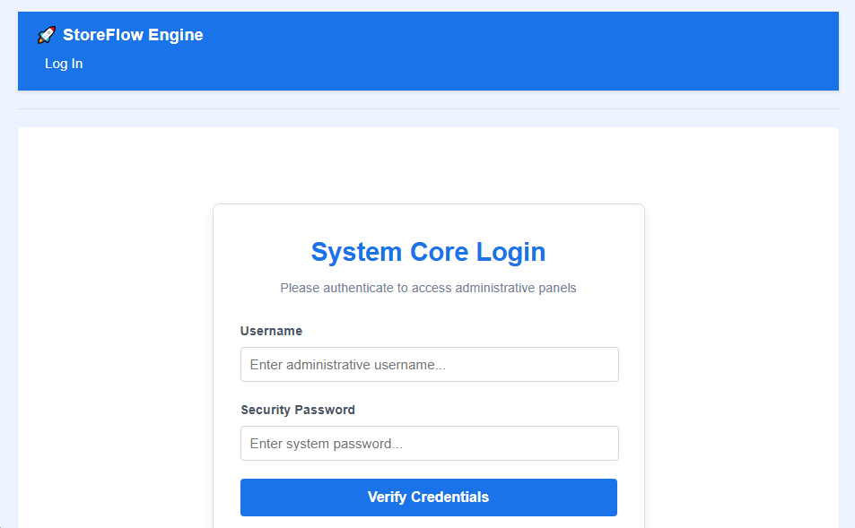

---

## 📊 Dashboard

A centralized dashboard displaying key business metrics, revenue insights, low-stock alerts, and sales analytics.

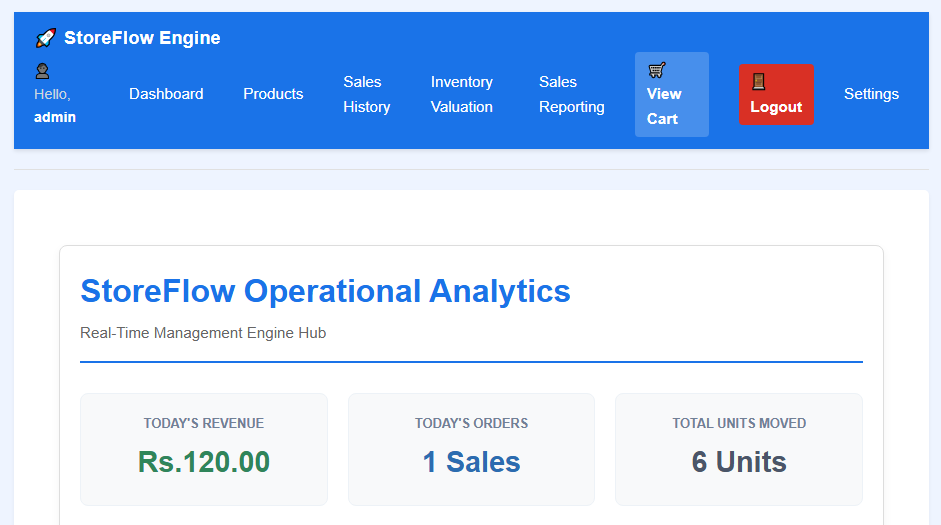

---

## 📦 Products Management

Manage inventory by adding, editing, searching, and deleting products.

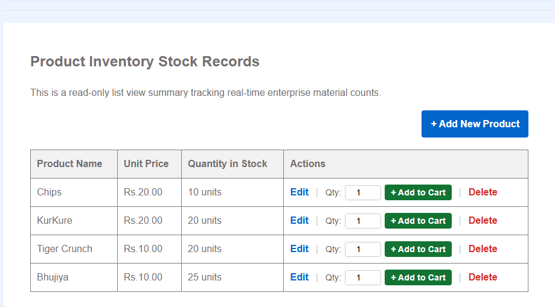

---

## ➕ Add Product

A validated product entry form with server-side validation and user-friendly error handling.

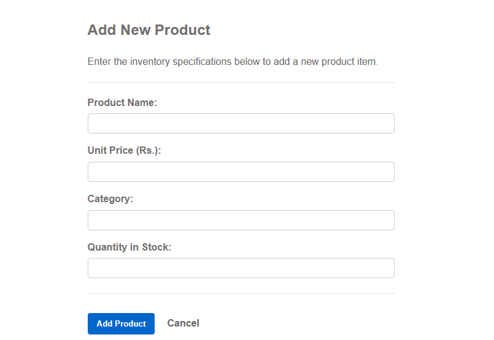

---

## 🛒 Shopping Cart

Manage customer purchases before checkout.

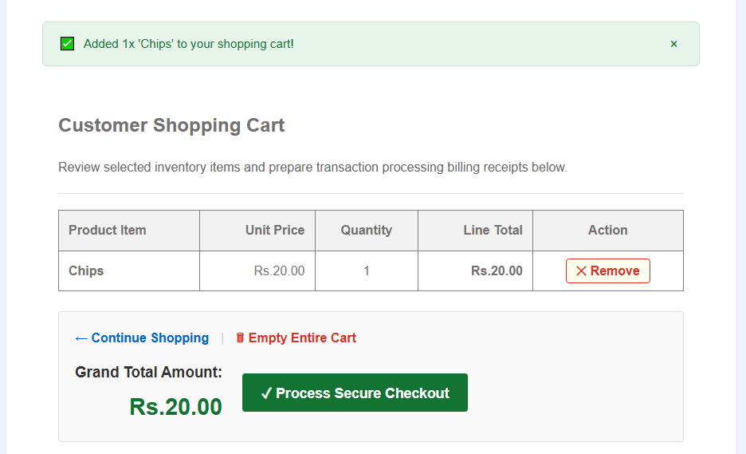

---

## 🧾 Generated Invoice

Automatically generated invoice with dynamic branding, tax calculation, and invoice numbering.

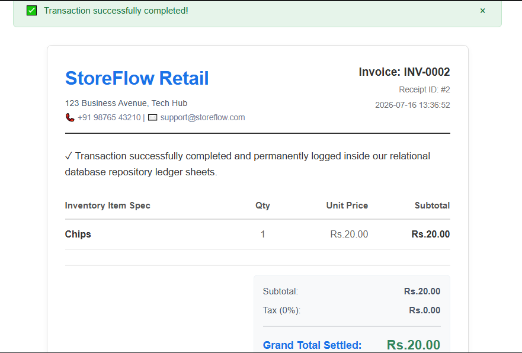

---

## 📊 Sales Report

Generate sales reports with date-based filtering and export support.

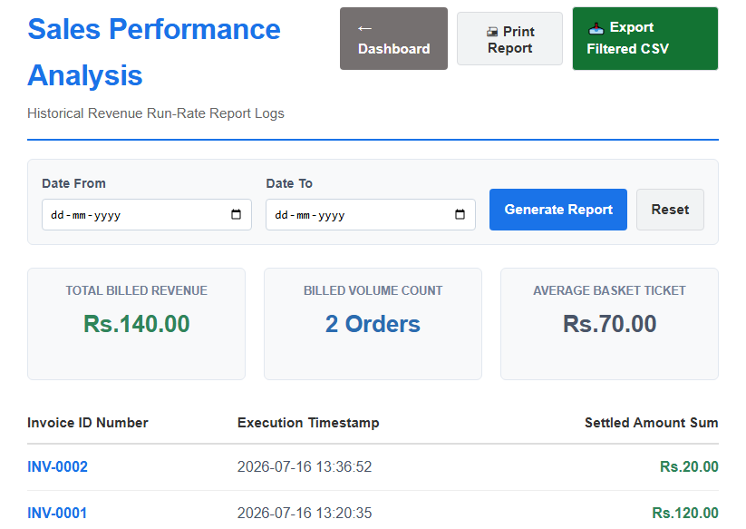

---

## 📜 Sales History

Browse previous sales records with filtering capabilities and invoice viewing.

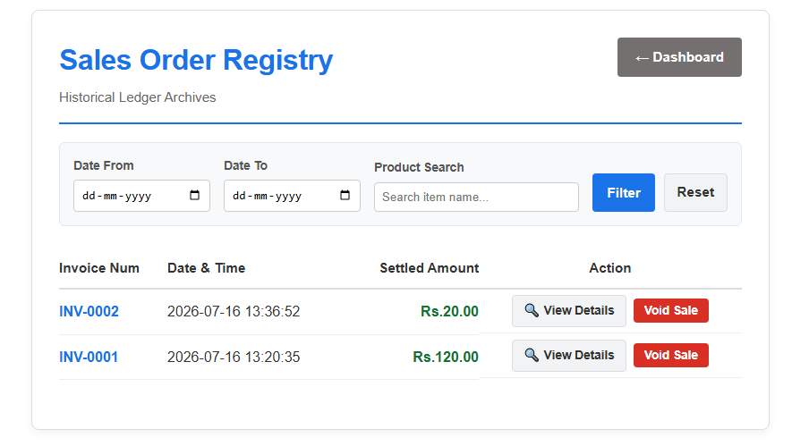

---

## 📈 Inventory Report

View current inventory valuation and stock summary.

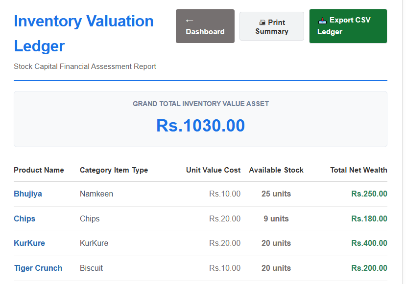

---

## ⚙️ System Settings

Configure store information, tax rate, currency, and low-stock threshold dynamically.

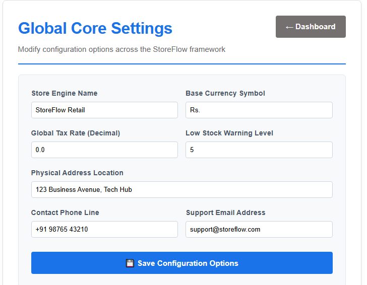

---

## 🚫 Custom 404 Error Page

A custom-designed error page displayed when users navigate to a non-existent route.

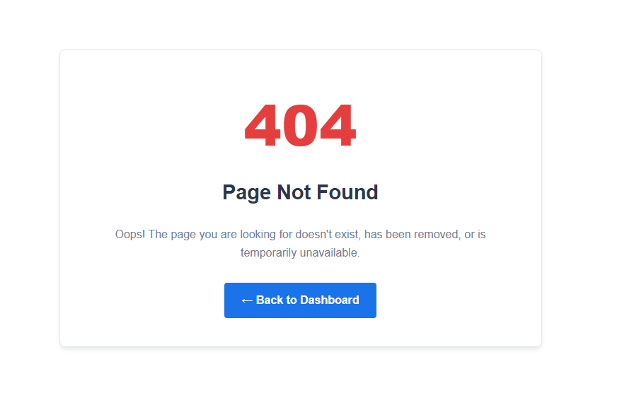

---

## ⚠️ Custom 500 Error Page

A friendly error page displayed whenever an unexpected server-side error occurs.

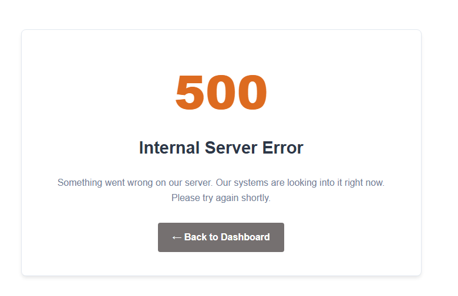

---

# 🧪 Software Engineering Concepts Practiced

This project was intentionally developed using professional software engineering practices.

During development I learned and applied:

- Layered Architecture
- Separation of Concerns
- Business Logic Design
- SQLite Database Design
- CRUD Operations
- SQL Transactions
- Atomic Operations
- Flask Routing
- Request Lifecycle
- Sessions
- Authentication
- Password Hashing
- Flash Messages
- Error Handling
- Validation
- Sanitization
- Reporting Systems
- Configuration Management
- Context Processors
- Git Workflow
- Code Reviews
- Refactoring

---

# 📚 What I Learned

Building StoreFlow helped me move beyond writing Python programs and begin thinking like a software engineer.

Some of the biggest lessons included:

- Designing applications before implementation.
- Separating presentation, business, and data layers.
- Building reusable and maintainable code.
- Understanding HTTP request flow.
- Designing relational databases.
- Managing user sessions securely.
- Implementing authentication.
- Validating and sanitizing user input.
- Writing production-oriented Flask applications.
- Maintaining projects using Git and GitHub.

Most importantly, I learned that software engineering is not only about making software work—it is about making software **maintainable, scalable, secure, and understandable**.

---

# 🚧 Future Improvements

The current version is fully functional, but several improvements are planned.

### Refactoring

- Reduce duplicated code
- Split large route files
- Improve helper functions
- Move remaining business logic out of Flask routes
- Improve project organization

### Security

- Environment variables for SECRET_KEY
- Role-based authentication
- Password reset functionality
- CSRF Protection
- Improved session management

### Features

- Customer Management
- Supplier Management
- Barcode Support
- PDF Invoice Export
- Email Receipts
- Product Images
- Advanced Dashboard Charts
- Multi-user Support
- User Roles & Permissions
- REST API
- Docker Support

---

# 🎯 Project Status

✅ Week 2 Complete

Current Stage:

**Refactoring & Code Quality Improvements**

Upcoming Stage:

**Production-Level Enhancements**

---

# 👨‍💻 Author

**Rishabh Mittal**

Aspiring Software Engineer | Python Developer | Computer Science Student

This project was built as part of a self-driven Software Engineering Bootcamp to learn how professional software systems are designed and developed.

GitHub:

```
https://github.com/mittalrishabh048
```

*(Replace with your actual GitHub profile link.)*

---

# 🙏 Acknowledgements

Special thanks to everyone who contributes educational resources that make self-learning software engineering possible.

This project represents countless hours of learning, experimentation, debugging, refactoring, and continuous improvement.

---


# ⭐ Support

If you found this project helpful or interesting:

⭐ Star the repository

🍴 Fork it

🛠 Suggest improvements

📢 Share feedback

Every contribution and suggestion helps make the project even better.

---

# 💬 Final Note

> **StoreFlow is more than an inventory management system—it represents my journey from writing Python scripts to understanding software engineering principles.**

This project taught me that great software is not built by adding features alone, but by carefully designing, refining, testing, documenting, and continuously improving the codebase.

Every module, feature, and refactoring step contributed to a deeper understanding of how real-world software is engineered.

Thank you for taking the time to explore StoreFlow!