# 🚀 StoreFlow Inventory Management System

> **A learning-driven Inventory, Billing, Reporting, and Analytics System built with Python, Flask, SQLite, HTML, and CSS.**

StoreFlow is a full-stack inventory management system developed as the capstone project of my **14-Day Software Engineering Bootcamp**.

The project started as a simple command-line inventory application and gradually evolved into a Flask-based web application with inventory management, billing, sales tracking, analytics, reporting, authentication, configuration management, and error handling.

The main goal was not simply to add features, but to learn how a software project can be **designed, structured, tested, refactored, documented, and maintained** while applying software engineering principles.

---

## 🚀 Live Demo

**Live Application:** https://storeflow-2tju.onrender.com

> Note: The deployed version is hosted on Render and may take a short time to wake up after inactivity.

---

# 📖 Project Overview

StoreFlow currently focuses on managing the day-to-day operations of a **single store**.

The application provides:

- Inventory management
- Product search
- Shopping cart and checkout
- Invoice generation
- Sales history
- Sale voiding with stock restoration
- Dashboard analytics
- Inventory and sales reports
- CSV exports
- User registration and authentication
- Database-backed store settings
- Input validation
- Custom error pages

### Current Scope

StoreFlow currently operates as a **single-store system with user authentication**.

Authentication allows multiple accounts to access the application, but store data is currently shared across accounts. **Multi-user / multi-store data isolation is planned for a future version.**

This keeps the current version focused on the core inventory and billing workflow while leaving room for the architecture to evolve later.

---

# ✨ Project Highlights

## 📦 Inventory Management

- Add Products
- Edit Products
- Delete Products
- Product Search by Name or Category
- Inventory Summary
- Low Stock Alerts
- Inventory Valuation
- Stock Updates

## 🛒 Billing & Sales

- Shopping Cart
- Quantity Management
- Checkout Workflow
- Automatic Invoice Generation
- Sequential Invoice Numbers
- Printable Invoices
- Historical Invoice Viewer
- Sales History
- Sale Voiding
- Automatic Stock Restoration after Voiding

## 📊 Dashboard & Analytics

- Daily Revenue
- Sales Count
- Units Sold
- Low Stock Alerts
- Top 5 Best-Selling Products
- Seven-Day Revenue Summary
- Dashboard KPIs

## 📑 Reports

- Inventory Valuation Report
- Sales Report
- Date-Based Sales Filtering
- Product-Based Sales Filtering
- Inventory CSV Export
- Sales CSV Export
- Dynamic CSV File Names

## 🔐 Authentication & Security

- User Registration
- Login
- Logout
- Password Hashing
- Flask Session Authentication
- Protected Routes
- Remember Me Sessions
- Server-Side Input Validation
- Input Sanitization
- Environment-Based Secret Configuration
- Flash Messaging
- Custom 404 and 500 Error Pages

## ⚙️ Configuration Management

StoreFlow provides database-backed configuration for:

- Store Name
- Address
- Phone Number
- Email
- Currency
- Tax Rate
- Low Stock Threshold

These settings are dynamically used throughout the application.

---

# 🛠 Tech Stack

| Category | Technology |
|----------|------------|
| Language | Python |
| Backend | Flask |
| Database | SQLite |
| Frontend | HTML5 |
| Styling | CSS3 |
| Template Engine | Jinja2 |
| Authentication | Flask Sessions + Werkzeug Password Hashing |
| Configuration | Python-dotenv |
| Version Control | Git |
| Repository Hosting | GitHub |

---

# 🏗 Software Architecture

StoreFlow follows a layered structure that separates the web interface, business logic, and database operations.

```text
                         Browser
                            │
                            ▼
                     Jinja2 Templates
                            │
                            ▼
                       Flask Routes
                            │
                            ▼
                    Business Logic Layer
                  ┌─────────────────────┐
                  │ InventoryManager    │
                  │ ShoppingCart        │
                  │ Billing Functions   │
                  └─────────────────────┘
                            │
                            ▼
                     Database Layer
                            │
                            ▼
                          SQLite
```

The main responsibility of each layer is separated as follows:

- **Flask Routes:** Handle HTTP requests, form submissions, redirects, and rendering.
- **Business Layer:** Handles inventory operations, cart logic, reporting preparation, authentication-related operations, and application logic.
- **Database Layer:** Handles SQLite connections, queries, transactions, users, sales, products, and settings.
- **Templates:** Provide the web interface using Jinja2.

---

# 🗂 Project Structure

```text
StoreFlow/
│
├── app.py
├── README.md
├── requirements.txt
├── .env.example
├── screenshots/
│
├── src/
│   ├── inventory/
│   │   ├── database.py
│   │   ├── manager.py
│   │   └── product.py
│   │
│   ├── billing/
│   │   └── billing.py
│   │
│   └── main.py
│
├── templates/
│   ├── base.html
│   ├── landing.html
│   ├── dashboard.html
│   ├── products.html
│   ├── addproduct.html
│   ├── cart.html
│   ├── invoice.html
│   ├── sales_history.html
│   ├── inventory_report.html
│   ├── sales_report.html
│   ├── login.html
│   ├── register.html
│   ├── settings.html
│   ├── delete_confirm.html
│   ├── 404.html
│   └── 500.html
│
├── static/
│   ├── css/
│   │   └── style.css
│   ├── js/
│   └── images/
│
└── data/
```

---

# 🧠 Software Engineering Principles Applied

The project was developed with an emphasis on software engineering practices rather than only feature implementation.

### Architecture & Organization

- Layered Architecture
- Separation of Concerns
- Business Logic Isolation
- Modular Project Structure
- Configuration Management

### Backend & Database

- Flask Routing
- SQLite Database Design
- CRUD Operations
- Parameterized SQL Queries
- SQL Transactions
- Atomic Database Operations
- Relational Data Modeling

### Application Security

- Authentication
- Password Hashing
- Session Management
- Protected Routes
- Server-Side Validation
- Input Sanitization
- Environment-Based Secrets

### Application Reliability

- Error Handling
- Custom 404 / 500 Pages
- Flash Messaging
- Data Persistence
- Validation and Testing

### Development Workflow

- Incremental Development
- Git Version Control
- GitHub Workflow
- Refactoring
- Code Review
- Documentation

---

# 📈 Development Journey

StoreFlow was developed incrementally over **14 days**.

The project evolved through several stages:

```text
CLI Inventory System
        ↓
SQLite Integration
        ↓
Inventory Management
        ↓
Flask Migration
        ↓
Web Interface
        ↓
CRUD Operations
        ↓
Shopping Cart
        ↓
Billing System
        ↓
Invoice Generation
        ↓
Sales History
        ↓
Reporting
        ↓
Analytics Dashboard
        ↓
Authentication & Registration
        ↓
Configuration Management
        ↓
Error Handling
        ↓
Testing & Stabilization
```

Each stage built upon the previous implementation rather than starting the project again from scratch.

---

# ⚙️ Installation Guide

## Prerequisites

Before running StoreFlow, make sure you have:

- Python 3.10 or later
- Git
- pip

## 1. Clone the Repository

```bash
git clone https://github.com/mittalrishabh048/StoreFlow.git
cd StoreFlow
```

## 2. Create a Virtual Environment

### Windows

```bash
python -m venv venv
venv\Scripts\activate
```

### macOS / Linux

```bash
python3 -m venv venv
source venv/bin/activate
```

## 3. Install Dependencies

```bash
pip install -r requirements.txt
```

## 4. Configure Environment Variables

Create a `.env` file in the project root and use `.env.example` as the template.

```env
SECRET_KEY=your-secret-key
ADMIN_USERNAME=your-admin-username
ADMIN_PASSWORD=your-admin-password
```

**Do not commit `.env` to GitHub.**

## 5. Initialize the Database

The application initializes the SQLite database when the application starts.

The database file is stored under:

```text
data/storeflow.db
```

The initial admin account is created from the `ADMIN_USERNAME` and `ADMIN_PASSWORD` environment variables when no users exist in the database.

## 6. Run StoreFlow

```bash
python app.py
```

Open:

```text
http://127.0.0.1:5000
```

---

# 🔑 Authentication

StoreFlow includes:

- User registration
- Username validation
- Password validation
- Password hashing
- Login authentication
- Protected routes
- Logout
- Remember Me sessions

The initial account can be configured through:

```env
ADMIN_USERNAME=your-admin-username
ADMIN_PASSWORD=your-admin-password
```

Additional accounts can be created through the registration page.

> **Current scope:** Authentication is implemented, but accounts currently access the same single-store data. Separate store ownership and data isolation are planned for a future version.

---

# 🗄 Database Design

StoreFlow uses **SQLite** as its relational database.

## `products`

| Field | Description |
|------|-------------|
| id | Product ID |
| name | Product Name |
| price | Product Price |
| category | Product Category |
| stock | Available Quantity |

## `sales`

| Field | Description |
|------|-------------|
| id | Sale ID |
| invoice_number | Sequential Invoice Number |
| timestamp | Sale Date & Time |
| total_amount | Sale Total |
| status | Active / Void |

## `sale_items`

| Field | Description |
|------|-------------|
| id | Item ID |
| sale_id | Related Sale |
| product_id | Purchased Product |
| quantity | Quantity Purchased |
| price_at_sale | Product Price at Sale |

## `users`

| Field | Description |
|------|-------------|
| id | User ID |
| username | Login Username |
| password | Hashed Password |

Passwords are stored using Werkzeug password hashing rather than plain-text passwords.

## `settings`

Stores application configuration as key-value pairs, including:

- Store Name
- Address
- Phone
- Email
- Currency
- Tax Rate
- Low Stock Threshold

---

# 📸 Application Screenshots

The following screenshots showcase the major modules and workflows of the StoreFlow Inventory Management System.

---

## 🔐 Login Page

Secure authentication before accessing the system.

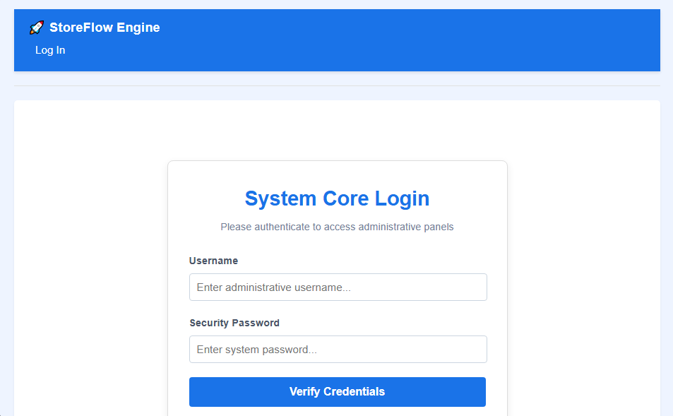

---

## 📊 Dashboard

A centralized dashboard displaying key business metrics, revenue insights, low-stock alerts, and sales analytics.

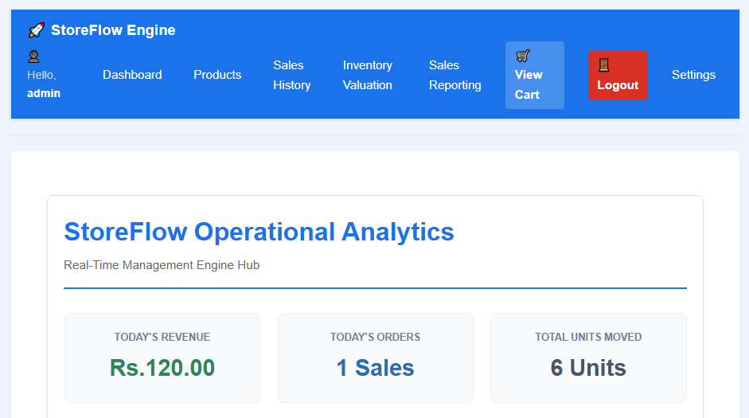

---

## 📦 Products Management

Manage inventory by adding, editing, searching, and deleting products.

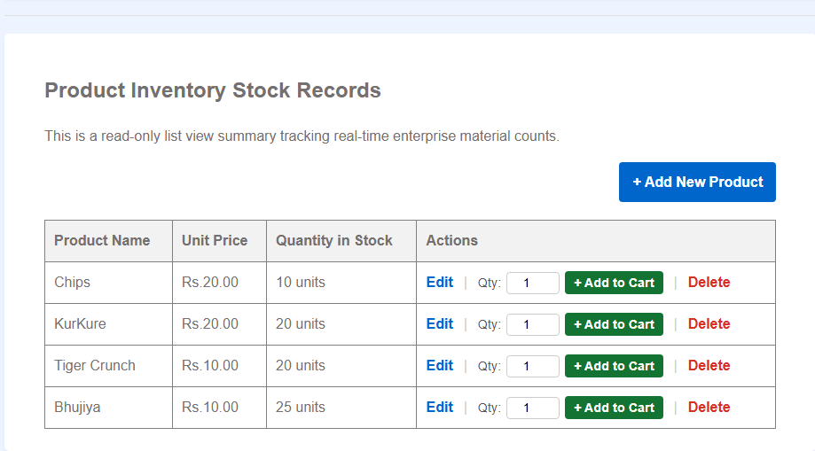

---

## ➕ Add Product

A validated product entry form with server-side validation and user-friendly error handling.

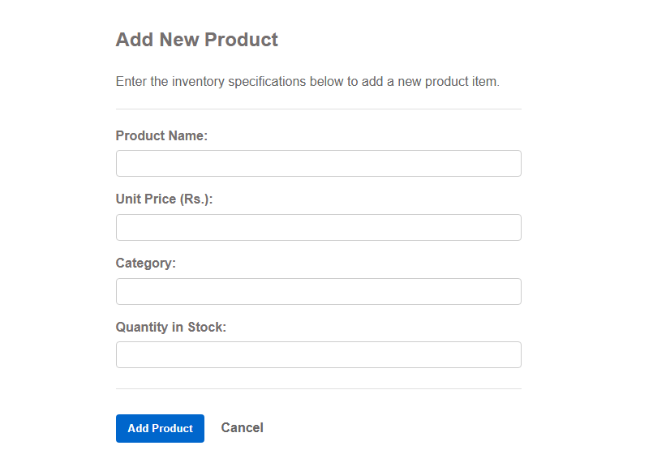

---

## 🛒 Shopping Cart

Manage customer purchases before checkout.

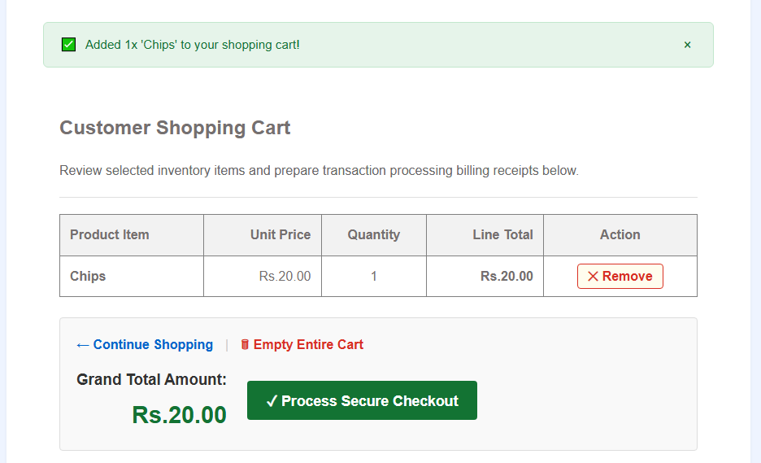

---

## 🧾 Generated Invoice

Automatically generated invoice with dynamic branding, tax calculation, and invoice numbering.

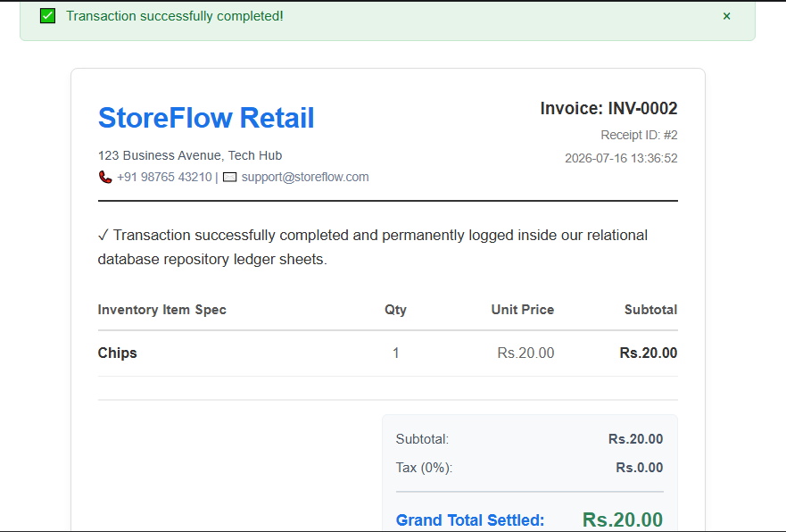

---

## 📊 Sales Report

Generate sales reports with date-based filtering and export support.

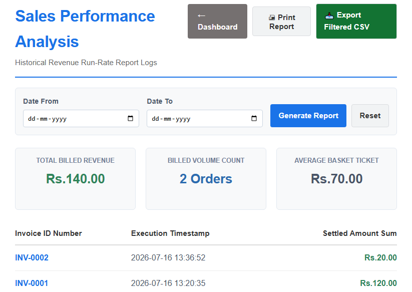

---

## 📜 Sales History

Browse previous sales records with filtering capabilities and invoice viewing.

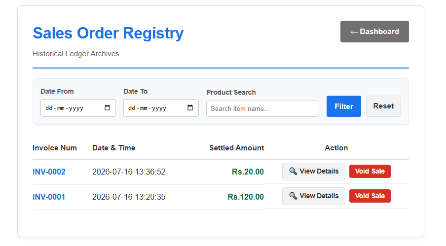

---

## 📈 Inventory Report

View current inventory valuation and stock summary.

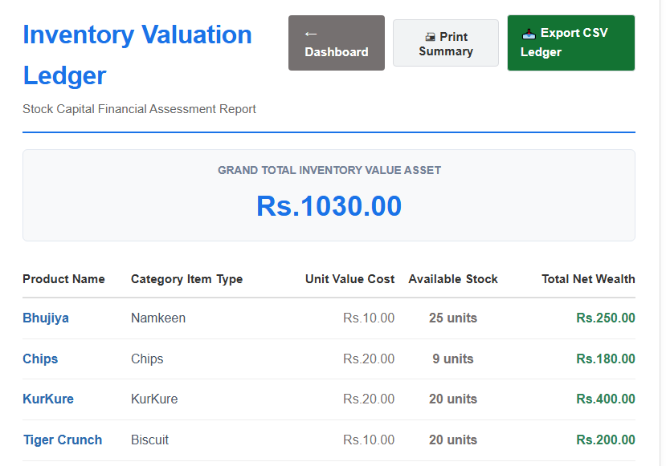

---

## ⚙️ System Settings

Configure store information, tax rate, currency, and low-stock threshold dynamically.

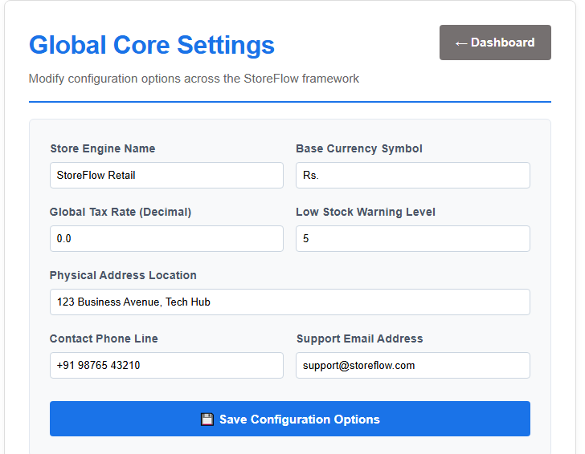

---

## 🚫 Custom 404 Error Page

A custom-designed error page displayed when users navigate to a non-existent route.

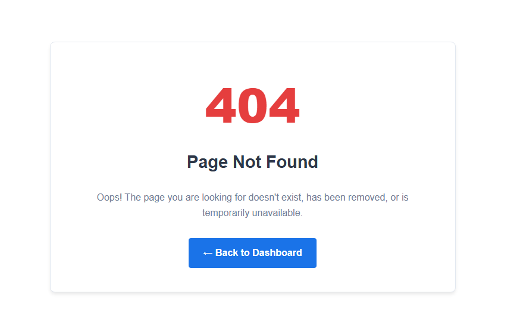

---

## ⚠️ Custom 500 Error Page

A friendly error page displayed whenever an unexpected server-side error occurs.

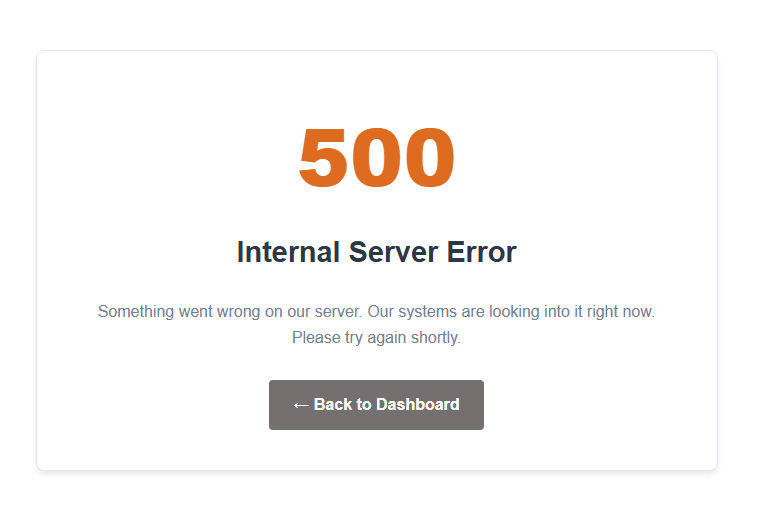

---

---

# 🧪 Testing & Stabilization

The current version was tested across several areas during development.

### Functional Testing

- Navigation
- Registration
- Login
- Logout
- Product CRUD
- Product Search
- Inventory operations
- Shopping Cart
- Checkout
- Invoice generation
- Sales History
- Sale Voiding
- Stock Restoration
- Dashboard
- Reports
- CSV Export
- Settings

### Edge-Case Testing

- Invalid registration inputs
- Duplicate usernames
- Invalid product values
- Invalid quantities
- Invalid URLs
- Empty cart checkout
- Invalid product references
- Repeated sale voiding

### Data-Integrity Testing

- Database persistence after restart
- Stock changes after checkout
- Stock restoration after voiding
- Invoice persistence
- Sales history persistence

### Authentication Testing

- Protected route access
- Login validation
- Registration validation
- Logged-in route behavior
- Logout behavior
- Session behavior

Testing helped identify issues during development and guided further stabilization of the current version.

---

# 📚 What I Learned

Building StoreFlow helped me move beyond writing isolated Python programs and start thinking more about software engineering.

Some of the biggest lessons were:

- Designing before implementing.
- Breaking an application into logical layers.
- Separating presentation, business logic, and database operations.
- Designing relational database tables.
- Understanding Flask request and response flow.
- Managing sessions and authentication.
- Validating user input on the server.
- Handling transactions and maintaining data integrity.
- Building reporting and analytics features.
- Using Git and GitHub throughout development.
- Debugging problems caused by interactions between different parts of the system.
- Testing features instead of assuming that working code is automatically correct.
- Refactoring existing code instead of constantly rewriting applications from scratch.

Most importantly, I learned that building software is an iterative process.

A feature working is only one step. Understanding how the feature fits into the rest of the application, testing it, finding problems, and improving the design are equally important parts of software engineering.

---

# 🚧 Current Limitations & Future Improvements

StoreFlow is a learning project and is **not intended to represent a perfect or production-ready commercial system**.

## 🔐 Security

- CSRF protection
- Role-Based Access Control
- More granular authorization
- Improved account security
- Password reset functionality
- Production HTTPS/session configuration

## 👥 Multi-User / Multi-Store Architecture

- Separate stores for different accounts
- Store ownership
- User-to-store relationships
- Data isolation between stores
- Multiple users within a store
- User roles and permissions

## 📦 Additional Business Features

- Customer Management
- Supplier Management
- Barcode Support
- Product Images
- PDF Invoice Export
- Email Receipts
- Advanced Dashboard Charts

## 🏗 Engineering Improvements

- Further refactoring
- More automated tests
- Improved database migrations
- REST API
- Docker Support
- Improved deployment configuration

These are future directions rather than features of the current version.

---

# 🎯 Project Status

**Current Version: V1**

### Current Focus

**Functional inventory and billing system with authentication, reporting, analytics, and configuration management.**

### Current Scope

**Single-store system with user authentication.**

### Future Direction

**Multi-user / multi-store architecture, stronger security controls, additional business features, and further engineering improvements.**

The current version represents a learning milestone rather than the final version of the project.

---

# 👨‍💻 Author

**Rishabh Mittal**

Aspiring Software Engineer | Python Developer | Computer Science Student

StoreFlow was built as part of my self-driven Software Engineering Bootcamp to learn how real-world software systems are designed, structured, tested, and improved.

GitHub:

https://github.com/mittalrishabh048

---

# 🙏 Acknowledgements

This project represents many hours of learning, experimentation, debugging, testing, refactoring, and documentation.

The project was developed with the help of educational resources and AI-assisted development tools as part of the learning process.

The goal was not simply to generate working code, but to understand the architecture, concepts, decisions, and implementation behind the system.

---

# ⭐ Support

If you find StoreFlow interesting:

- ⭐ Star the repository
- 🍴 Fork the project
- 🛠 Suggest improvements
- 💬 Share feedback

---

# 💬 Final Note

> **StoreFlow represents my journey from writing Python programs to thinking more like a software engineer.**

What started as a command-line inventory application gradually became a Flask-based system with inventory management, billing, sales tracking, analytics, reporting, authentication, configuration, and database-backed workflows.

The most valuable part of the project was not the number of features.

It was learning how to:

**design → implement → test → debug → refactor → document → improve**

and repeat the process.

StoreFlow is still evolving, and the current V1 is only one step toward a larger system.

Thanks for taking the time to explore the project! 🚀
